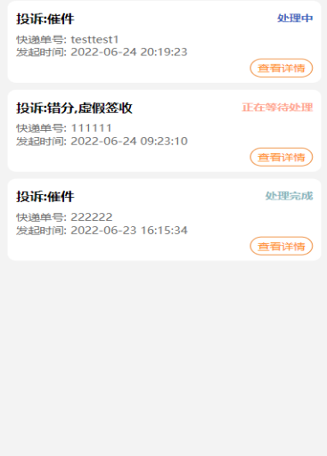
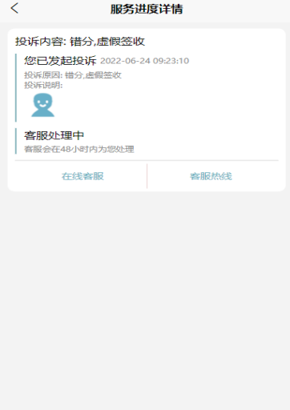
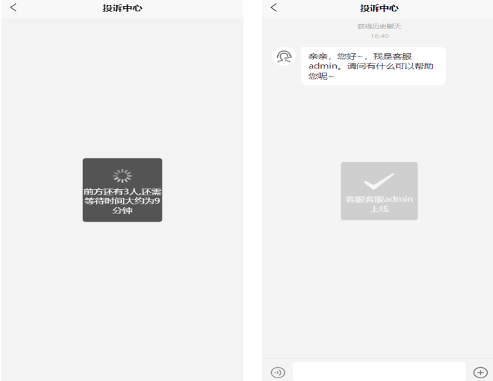

# chatRoom

### 一、介绍
基于springboot+websocket+redis+mysql实现客服聊天室功能，实现ftp实现文件的上传

### 二、软件架构
springboot+websocket+redis+mysql+SpringCloud-openfegin

### 三、使用说明
 本项目基于Spring平台，整合websocket协议，实现一个简易客服聊天室的功能。主要特性如下:

1. 包含聊天室登录、退出的功能。登录时，浏览器自动向服务器发起websocket连接，退出时自动切断。登录页面为http://localhost:8080/login

2. 用户可查看到投诉的列表，我们在服务器上通过一个ConcurrentHashMap记录了当前客服聊天室列表；

3. 一对一对话；登录的用户可以创建一个在线的聊天室，计算当前的等待人数和等待时间，客服根据房间号加入房间后并回复客户发送的消息，用户收到消息后即可回复；

4. 支持在聊天室进行多文件和图片的上传和下载，并使用定时任务进行维护;

5. pingpong进行心跳检测，保持长连接。

6. 使用redis记录加入房间和退出房间的状态，更新等待人数和等待时间

### 四、效果图片
#### 排队的情况

#### 当前投诉情况的进度

#### 当前排队人数+客服上线

